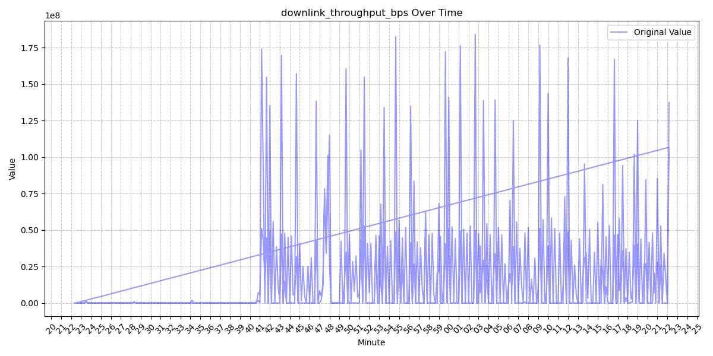
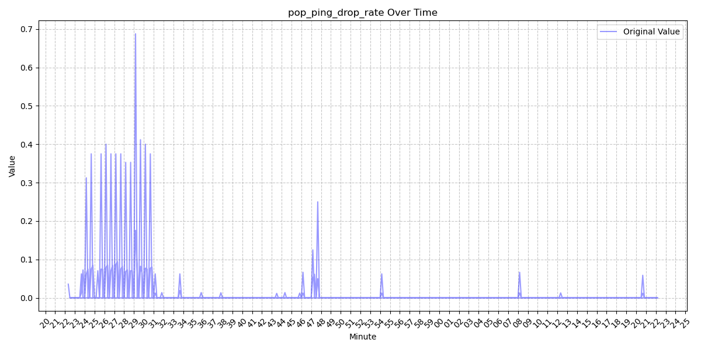
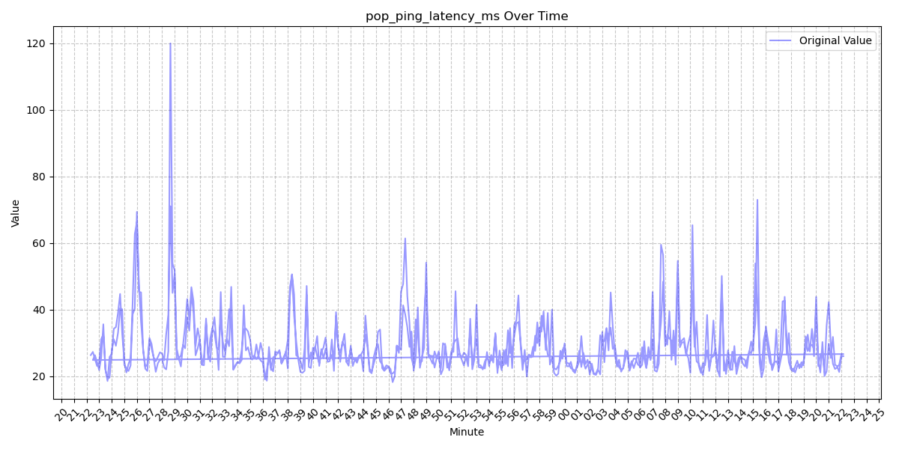
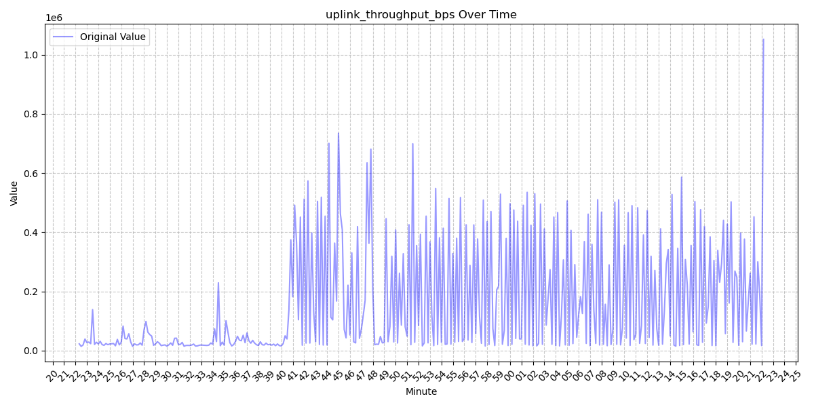

# Starlink Application Layer Tests

On 10-29-2024 4K video was streamed on a starlink connection measuring the throughput and ping. This measurement took place in the center of the University of Minnesota twin cities campus. 

## Prerequisite install
Docker Compose and Grafana configs to stand up:
* [starlink-grpc-tools](https://github.com/sparky8512/starlink-grpc-tools)
* InfluxDB
* Grafana
  * [Starlink Dashboard](#grafana-starlink-dashboard-screenshot)

## Running Containers
* [Install Docker Desktop on Mac](https://docs.docker.com/desktop/mac/install/)  
* Install **docker-compose**  
   ```sudo curl -L "https://github.com/docker/compose/releases/download/v2.5.0/docker-compose-$(uname -s)-$(uname -m)" -o /usr/local/bin/docker-compose```

   ```sudo chmod +x /usr/local/bin/docker-compose```
* Clone Repo  
 ```git clone https://github.com/rzzldzzl/starlink-mon.git```  
* Execute **docker-compose**  
   ```docker-compose -f starlink-mon/docker-compose.yaml up -d```

## Grafana Url
http://localhost:3000/d/mwneEVwnz/starlink-stats

username:admin

password:password

## Processed Data







### Downlink Throughput (bps)
| **Statistic**     | **Value**          |
|-------------------|--------------------|
| Mean              | 14,699,017.39     |
| Median            | 33,969.67         |
| Standard Deviation| 32,960,091.46     |
| Minimum           | 7,046.43          |
| Maximum           | 184,017,712.0     |
| Count             | 719               |

### POP Ping Drop Rate
| **Statistic**     | **Value**          |
|-------------------|--------------------|
| Mean              | 0.01197           |
| Median            | 0.0               |
| Standard Deviation| 0.05727           |
| Minimum           | 0.0               |
| Maximum           | 0.6875            |
| Count             | 719               |

### POP Ping Latency (ms)
| **Statistic**     | **Value**          |
|-------------------|--------------------|
| Mean              | 28.59             |
| Median            | 26.06             |
| Standard Deviation| 8.52              |
| Minimum           | 18.22             |
| Maximum           | 119.91            |
| Count             | 719               |

### Power (W)
| **Statistic**     | **Value**          |
|-------------------|--------------------|
| Mean              | 77.36             |
| Median            | 76.74             |
| Standard Deviation| 10.66             |
| Minimum           | 44.99             |
| Maximum           | 124.63            |
| Count             | 360               |

### Uplink Throughput (bps)
| **Statistic**     | **Value**          |
|-------------------|--------------------|
| Mean              | 159,151.10        |
| Median            | 41,186.39         |
| Standard Deviation| 190,623.97        |
| Minimum           | 14,150.74         |
| Maximum           | 1,051,725.08      |
| Count             | 360               |